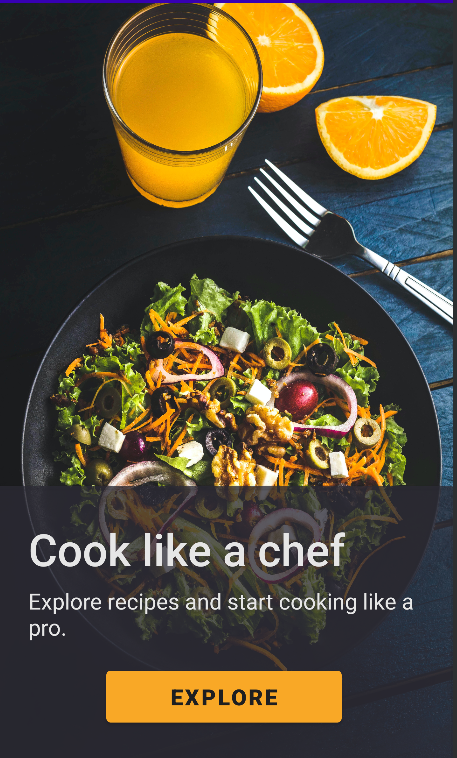
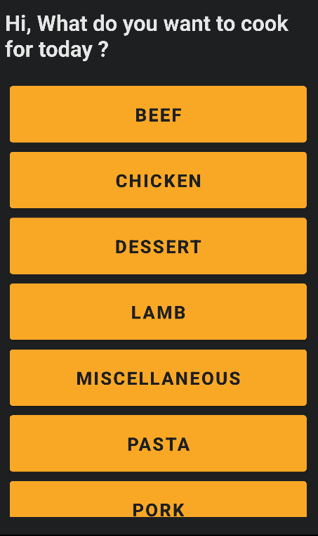
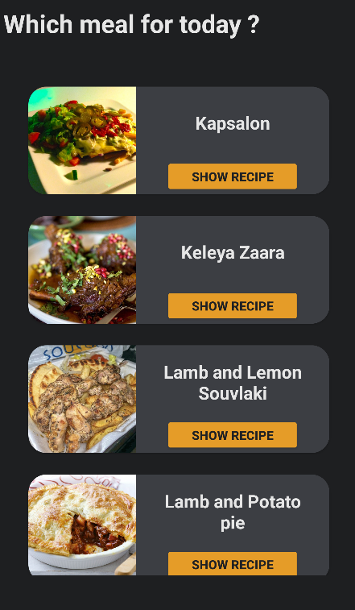
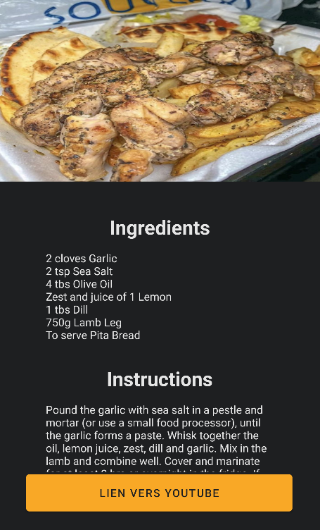

# Recipe App

## Binôme :

-   JAMIL Mohammed
-   NASDAMI Quatadah

## Application

Notre application, Recipe App, utilise l'API MealDB pour afficher des recettes à nos utilisateurs. Les activités de l'application incluent :

### Fonctionnalités dévelopées

-   `MainActivity` : est la page d'accueil de l'application, où l'utilisateur peut parcourir les recettes les plus populaires et les plus récentes.  

    

-   `CategoriesActivity` : permet à l'utilisateur de parcourir les différentes catégories de recettes disponibles, telles que les plats principaux, les desserts, etc.  

    

-   `MealsActivity` : affiche les recettes d'un repas spécifique.  

    

-   `RecipeActivity` : affiche les détails de la recette sélectionnée, y compris les ingrédients et les instructions.  

    

### Difficultés rencontrées

En développant cette application, nous avons rencontré des difficultés en ce qui concerne l'intégration de l'API MealDB, car il y avait des incohérences dans les données renvoyées. Nous avons également rencontré des difficultés pour afficher les images de recettes de manière efficace. Nous avons résolu ces problèmes en utilisant des bibliothèques tierces pour gérer les appels à l'API et en optimisant les images pour une meilleure performance de l'application.

### Conclusion

En résumé, Recipe App est une application android simple, mais efficace qui permet aux utilisateurs de parcourir des milliers de recettes différentes, avec des catégories pour faciliter la recherche des recettes.
